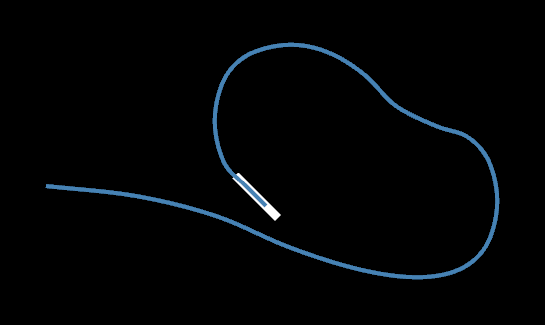

# Toy Airport

Toy Airport is a minimal airplane simulator written in Rust.
The initial version is still in progress, current work is just back-end calculation.
The movement for the plane was inspired by the rules of the game [Racetrack](https://en.wikipedia.org/wiki/Racetrack_(game)).
Here's one of the landing paths:



## Installation

Currently this is only distributed by source.
Clone the Git repository and run it with [Cargo](https://doc.rust-lang.org/cargo/getting-started/index.html).

```sh
git clone https://github.com/Swiddis/toy-airport.git && cd toy-airport
cargo run --release
```

## Usage

Currently the project computes and outputs a landing path.
If run outside of `--release` mode, computation time will make the project seem to hang.
Give it a few seconds to load, fixing this is a work-in-progress.
You can tweak the settings in `main.rs`.

## Todo

- Add a graphical front-end
- Procedural plane generation
- Support more complicated airport logic
- More efficient routing

## Contributing

Pull requests are welcome.
For major changes, please open an issue first to discuss what you would like to change.

## License

This project is licensed under the [MIT License](https://choosealicense.com/licenses/mit/), see `LICENSE.txt` for details.
